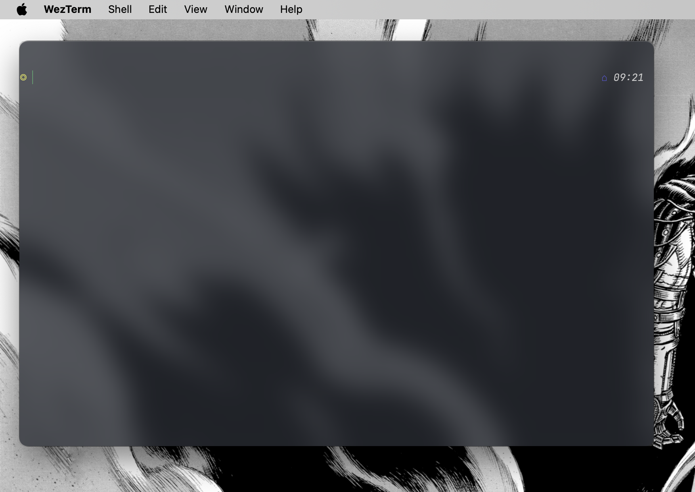

# Лабораторная работа №1

Подготовил

- Студент 10 группы 2 курса БГУ ФПМИ ПИ
- Петраков Семён

## ЗАДАНИЕ 1. УСТАНОВКА СИСТЕМЫ ВИРТУАЛИЗАЦИИ И ОС MACOS

- Лабораторная работа написана на Mac OS Sequoia 15.1 на базе Macbook Air M1

## ЗАДАНИЕ 2. РАБОТА В КОМАНДНОЙ СТРОКЕ

### 1. Изучить статьи:

◦ https://www.maketecheasier.com/macos-terminal-beginners-guide/
◦ https://lifehacker.ru/komandy-terminala-macos/
◦ https://habr.com/ru/articles/143341/
◦ https://zhuosongz.github.io/docs/cheatsheets/mac_terminal.pdf

- Сделано

### 2. Запустить приложение Terminal.

### 3. Изучить структуру команд на примере команды echo 'Hello World'.

### 4. Рассмотреть команды ls, cd, vi, more, less, mkdir, cat, cp, mv, rm, find, !!, history, clear, sudo и описать их назначение.

- **ls**: Отображает список файлов и директорий в текущем каталоге. Поддерживает опции, такие как `-l` для подробного списка и `-a` для отображения скрытых файлов.

- **cd**: Переходит в указанную директорию. Например, `cd /home` переместит вас в каталог `/home`.

- **vi**: Текстовый редактор для создания и редактирования текстовых файлов в командной строке. Имеет командный и режим редактирования.

- **more**: Постраничный просмотр содержимого файла. Удобен для больших файлов.

- **less**: Похож на `more`, но с большими возможностями, такими как просмотр файла вперед и назад и поиск текста.

- **mkdir**: Создает новую директорию. Например, `mkdir new_folder` создаст папку `new_folder`.

- **cat**: Выводит содержимое файла на экран. Может объединять несколько файлов в один.

- **cp**: Копирует файлы или директории. Например, `cp file1 file2` создаст копию `file1` с именем `file2`.

- **mv**: Перемещает или переименовывает файлы и директории. Например, `mv file1 file2` переименует `file1` в `file2`.

- **rm**: Удаляет файлы или директории. Например, `rm file1` удалит файл `file1`.

- **find**: Ищет файлы и директории в файловой системе. Например, `find / -name "file.txt"` найдет все файлы с именем `file.txt`, начиная с корневого каталога.

- **!!**: Повторно выполняет последнюю введенную команду.

- **history**: Отображает список ранее выполненных команд в текущей сессии терминала.

- **clear**: Очищает экран терминала, оставляя только приглашение командной строки.

- **sudo**: Выполняет команды с правами суперпользователя (root). Например, `sudo apt-get update` обновит список пакетов с правами администратора.

### 5. Выведите сообщение «Имя Фамилия», указав Ваше имя и фамилию, в виде нескольких строк с помощью команд echo и banner. При необходимости установите требуемое приложение.

### 6. Прочитайте статью справочной системы man о пользовании справочной системой.

### 7. Прочитайте статью справочной системы о команде uname. Из какого раздела справочника Вы прочитали статью?

- 1 раздел

### 8. Определите имя машины, название и версию операционной системы, с которой Вы работаете. Каков аппаратный тип системы?

### 9. Выведите дату в форматах dd-mm-yy, mm-dd-yy hh:mm:ss.

### 10. Выведите дату в две строки: на первой – день, месяц, год, на второй – текущее время, снабдив вывод комментарием с Вашим именем и фамилией.

### 11. Выведите календарь на текущий месяц, на месяц Вашего рождения текущего года.

### 12. Выведите календарь на будущий год. В каком столбце отображаются воскресенья? Какую команду использовать, чтобы неделя начиналась с понедельника? С воскресенья?

### 13. Определите порядковый номер текущего дня с начала года.

### 14. Используя команду write, пошлите сообщение на консоль.

### 15. Используя команду mesg, определите, разрешены ли сообщения на Ваш терминал. Запретите сообщения. Какова будет реакция системы, если ктонибудь попытается передать Вам сообщение?

### 16. Прочитайте свою почту в консоли.

### 17. Привести несколько примеров команды конвертации файла .doc в формат .html. Привести несколько примеров изменения кодировки файла, например из cp1251 в utf-8.

## ЗАДАНИЕ 3. РАБОТА С ФАЙЛАМИ cat 
1. Создавать файл dirlist.txt, состоящий из 13 строк. Нечётные строки — пустые, чётные — содержат 2) Ваше ФИО, 4) место (город/посёлок)
проживания, 6) улица проживания, 8) область проживания, 10) список Ваших хобби и интересов.

2. вывести содержимое файла dirlist.txt: a в обратном порядке b с нумерацией непустых строк c с нумерацией всех строк d схлопывая подряд идущие пустые строки в одну Работа с файлами 

3. Просмотрите содержимое Вашего домашнего каталога.
   
4. Определите имя своего домашнего каталога и его родительского каталога.
   
5. Определите полный путь до Вашего домашнего каталога. 
   
6. Создайте в своём домашнем каталоге подкаталоги вида и выведите их структуру в виде дерева:
   
7. Находясь в домашнем каталоге, с помощью команды touch создайте файл macintosh в имеющемся каталоге apple и несколько файлов в каталогах dark и green. 
   
8. Войдите в каталог flowers. Находясь в каталоге flowers, скопируйте все подкаталоги fruits вместе с находящимися в них файлами в специально созданный каталог basket. 
   
9. Находясь в каталоге flowers, удалите каталог fruits. 

## ЗАДАНИЕ 4. Изучение GitHub 
Задание выполнено
## ЗАДАНИЕ 5. РАЗРАБОТКА ПРИЛОЖЕНИЯ НА ЯЗЫКЕ C
1. Создайте каталог, например lab1. Каталог создайте в домашнем каталоге или каталоге, где размещается свои выполненные задания. 
2. В каталоге lab1 создайте каталог src. 
3. Познакомьтесь со справочной документацией текстовых редакторов nano и vim. Текстовый редактор nano (http://help.ubuntu.ru/wiki/nano) или vim (http://www.opennet.ru/docs/RUS/vim_cookbook/). Изучите основные команды и комбинации клавиш для управления текстовыми редакторами. 
4. Используя редактор nano или vim, напишите программу согласно заданию по вариантам. Обязательное условие — приложение на языке C. 
5. В командной строке скомпилируйте программу, используя компилятор gcc, и выполните исполняемый файл. Чтобы использовать компилятор gcc, в среде macOS должны быть установлены инструменты командной строки (Command line tools), которые являются компонентом IDE Xcode (https://www.freecodecamp.org/news/installxcode-command-line-tools/). 
6. Подготовьте примеры входных и выходных данных для проверки работы приложения. Для проверки правильности работы программы студенту необходимо разработать набор тестов и на их основе провести тестирование программы. Тестовый набор должен включать примеры входных и выходных данных, приведённые в тексте задачи, а также тесты, разработанные студентом самостоятельно. Пример оформления протокола тестирования программы на определение количества вхождений слов в строке представлен в таблице 1. Программы, не прошедшие тестирование, к защите не принимаются. В случае неверной работы программы хотя бы на одном тесте студент обязан выполнить отладку программы для поиска и устранения ошибки. Таблица 1. Пример протокола тестирования задачи на определение количества вхождений слова в строке

   ## ЗАДАНИЕ 6. РАБОТА С GIT-РЕПОЗИТОРИЕМ 
   1. Перейти по ссылке-приглашению, опубликованному для Вашей подгруппы в теме 2 курса на сайте https://edufpmi.bsu.by/.
   2. Открыть приложение terminal, в котором будут выполняться дальнейшие команды. 
   3. Изучить документацию Генерация открытого SSH-ключа в macOS и добавление в Github account. Сгенерировать ssh-ключ и добавить публичный ключ в свою учетную запись на Github. Если ключ генерируется на компьютер в классе, то имя файла для его хранения сохраните с указанием фамилии. 
   4. Создать каталог tp-lab2-gr9a, где 9a — номер группы.
   5. Перейти в каталог tp-lab1-gr9a, который будет использоваться как каталог репозитория.
   6. Выполнить инструкции на странице репозитория в консоли macOS. При подключении использовать ссылку для репозитория (см. рис. ниже)
   7. Создать файл Readme согласно рекомендациям на странице репозитория (см. рис. выше). 
   8. Добавить файл Readme в список отслеживаемых (git add) и зафиксировать в репозитории (закоммитить) (git commit). Данная последовательность команд обеспечивает создание ветки Master1 . Если не опубликовать первый коммит и попробовать создать ветку, то ветка Main не будет создана! Опубликовать изменения из локального репозитория во внешнем репозитории на github, выполнив команду git push, т. е. запушить. 
   9. Отправьте изменения во внешний репозиторий. Требуется ли ввод пароля после добавления ssh-ключа? 
   